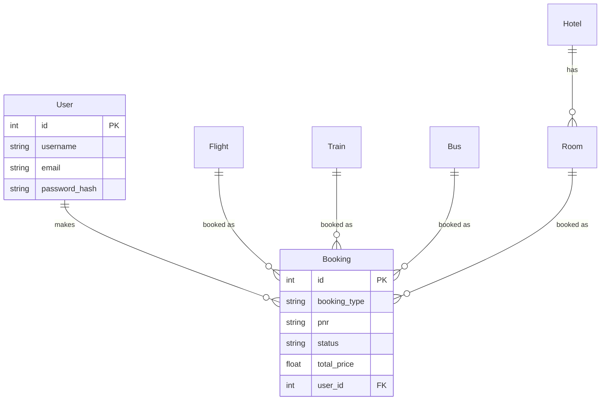

<p align="center">
  
  
  
  
</p>

<h1 align="center">🐍 Py-Booking</h1>
<h4 align="center"><code>>>> booking != painful</code></h4>
<p align="center">
  A full-stack travel booking platform built with Python & Flask.<br>
  <i>What IRCTC could've been, if they <code>pip install</code>'d better developers.</i>
</p>

---

> **📌 Academic Submission**
> This project is submitted in compliance with the **Final Project Submission** of the **PEP (Python for Everyone & Professionals) Class**, supervised by **Bhanu Teja Sir**.

---

## ✨ Features

| Module          | What it does                                                                  |
| --------------- | ----------------------------------------------------------------------------- |
| ✈️ **Flights**  | Search by city name (auto-resolves to IATA codes), browse results, book seats |
| 🚂 **Trains**   | Case-insensitive station search, class-wise pricing (SL/3A/2A/1A), PNR status |
| 🚌 **Buses**    | Filter by type (Sleeper/Semi-Sleeper/Seater), operator-wise results           |
| 🏨 **Hotels**   | City search, room type selection, date-based availability                     |
| 🔐 **Auth**     | Signup, Login, Logout with hashed passwords (PBKDF2-SHA256)                   |
| 👤 **Profile**  | View booking history, cancel bookings, manage account                         |
| 💳 **Payments** | Mock payment gateway with booking confirmation & PNR generation               |

## 🏗️ Tech Stack

```
Backend  → Flask (Python micro-framework)
ORM      → SQLAlchemy + SQLite
Auth     → Flask-Login + Werkzeug password hashing
Frontend → Jinja2 templates + Tailwind CSS (CDN)
Fonts    → Google Fonts (Inter)
Icons    → Font Awesome 6
```

## 📁 Project Structure

```
Ticket-Booking-App/
├── app/
│   ├── blueprints/       # Route handlers (flights, trains, buses, hotels, auth)
│   ├── static/
│   │   ├── css/style.css # Custom stylesheet (dark theme)
│   │   └── js/app.js     # Client-side JS (tabs, autocomplete, loader)
│   ├── templates/        # Jinja2 HTML templates
│   ├── __init__.py       # App factory
│   ├── extensions.py     # Flask extensions
│   └── models.py         # SQLAlchemy models
├── config.py             # Configuration classes
├── seed_data.py          # Realistic data generator (30 days of schedules)
├── run.py                # Application entry point
└── requirements.txt      # Python dependencies
```

## 🚀 Quick Start

```bash
# 1. Clone the repository
git clone https://github.com/biplavbarua/Ticket-Booking-App.git
cd Ticket-Booking-App

# 2. Create & activate virtual environment
python3 -m venv venv
source venv/bin/activate        # macOS/Linux
# venv\Scripts\activate         # Windows

# 3. Install dependencies
pip install -r requirements.txt

# 4. Seed the database
python seed_data.py

# 5. Run the application
python run.py
```

Then open **http://127.0.0.1:5001** in your browser.

## 🗄️ Database Schema



## 🎨 Design

The UI is a deliberate parody of Indian government booking portals — featuring a tricolor stripe, Ashoka Chakra–inspired logo, and tongue-in-cheek copy like _"Faster than Tatkal"_ and _"`password != '123456'`"_. Built with a professional dark theme using Tailwind CSS and custom CSS variables.

## 📊 Seed Data

The `seed_data.py` script generates realistic travel data:

- **600 flights** across 20 Indian routes
- **510 trains** across 17 routes (including Rajdhani, Shatabdi, Express)
- **450 buses** across 15 routes
- **10 hotels** with multiple room types across 6 cities

## 🙏 Acknowledgements

- **Bhanu Teja Sir** — for supervising the PEP class and this project
- **Flask & SQLAlchemy** — for making Python web development a joy
- **IRCTC** — for the _inspiration_ ☕

---

<p align="center">
  <code>No exceptions. Just bookings.</code><br>
  <sub>Built with <code>&lt;3</code> and questionable <code>sleep()</code> schedules.</sub>
</p>
